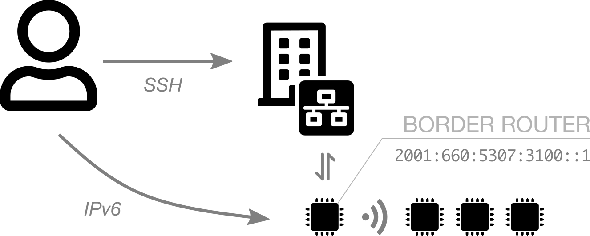

# Schemas proposal

## Infrastructure design

A - Minimal

B - Layers

C - Interact

D - Total

## Hardware design

1 - Microcontroller

2 - Embedded Linux

## Serial link

## Serial aggregator

## Sniffer aggregator

## Monitoring

## Debug

## SSH-cli

## IPv6

