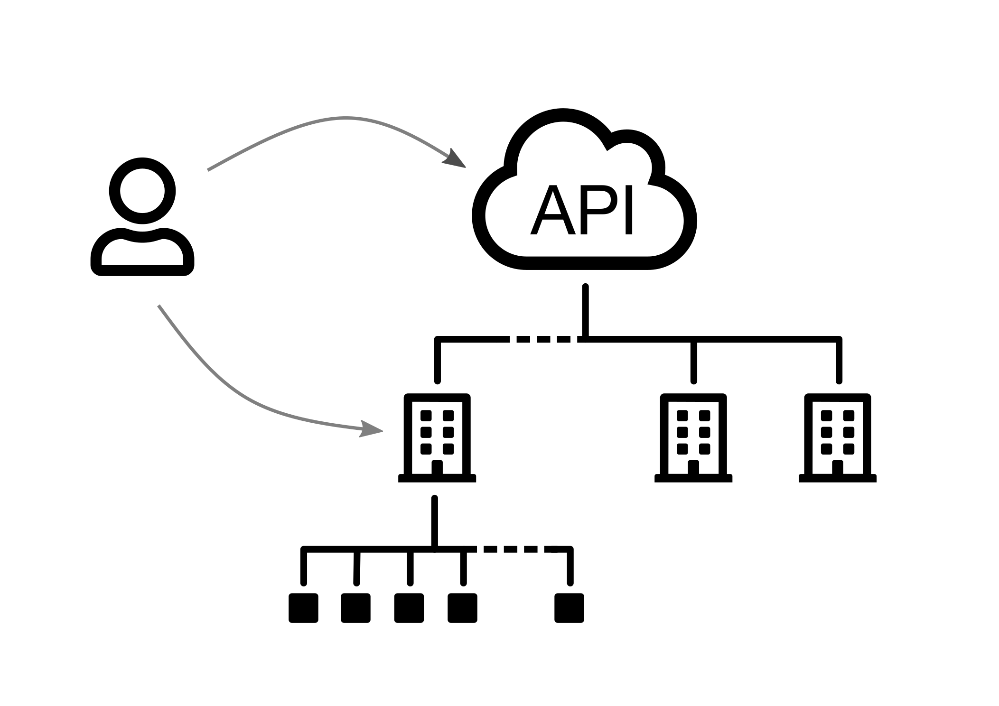
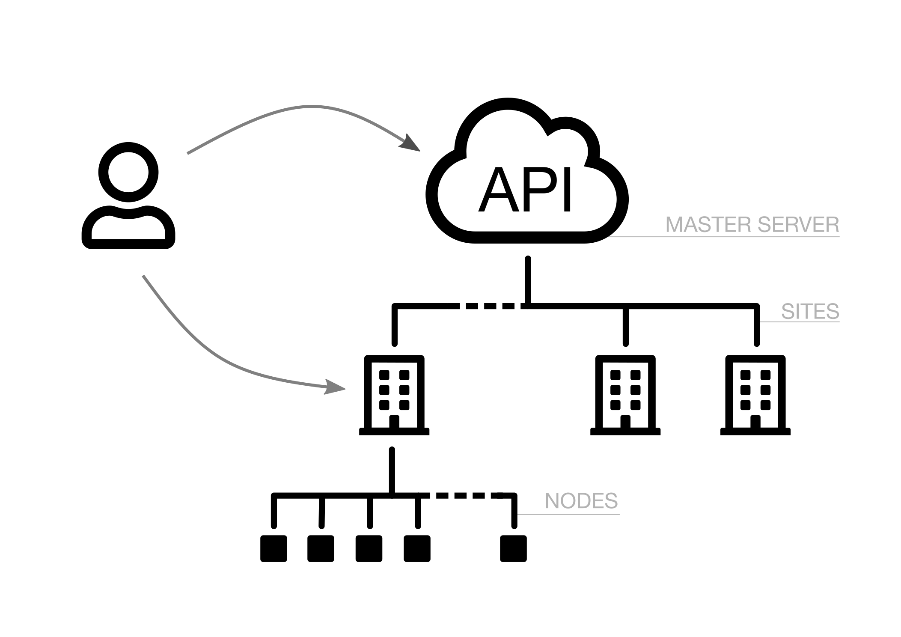
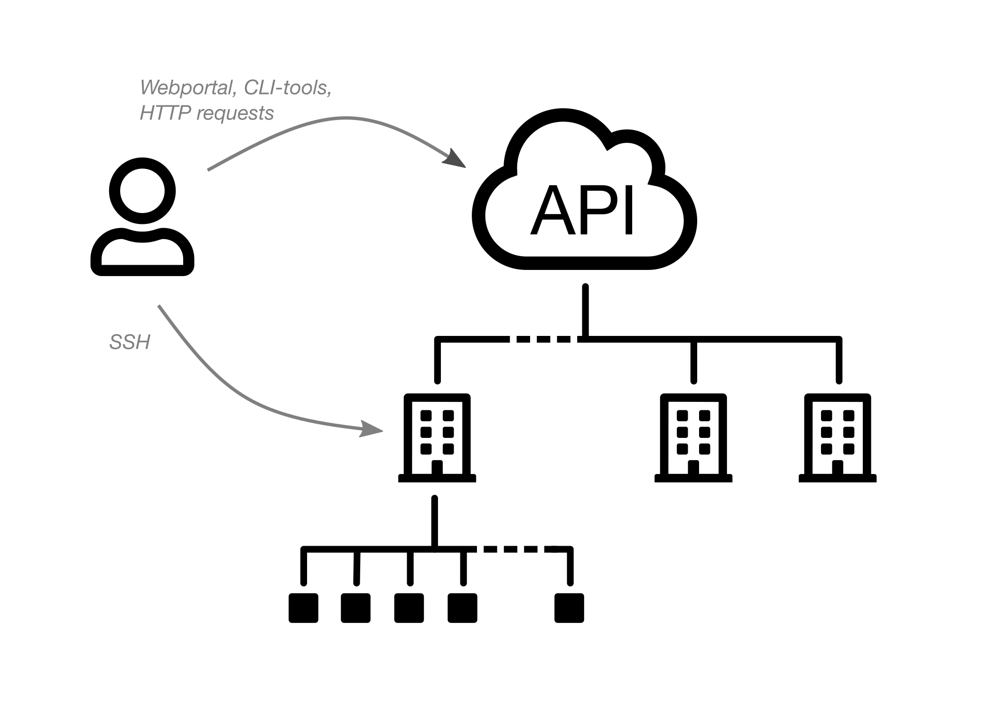
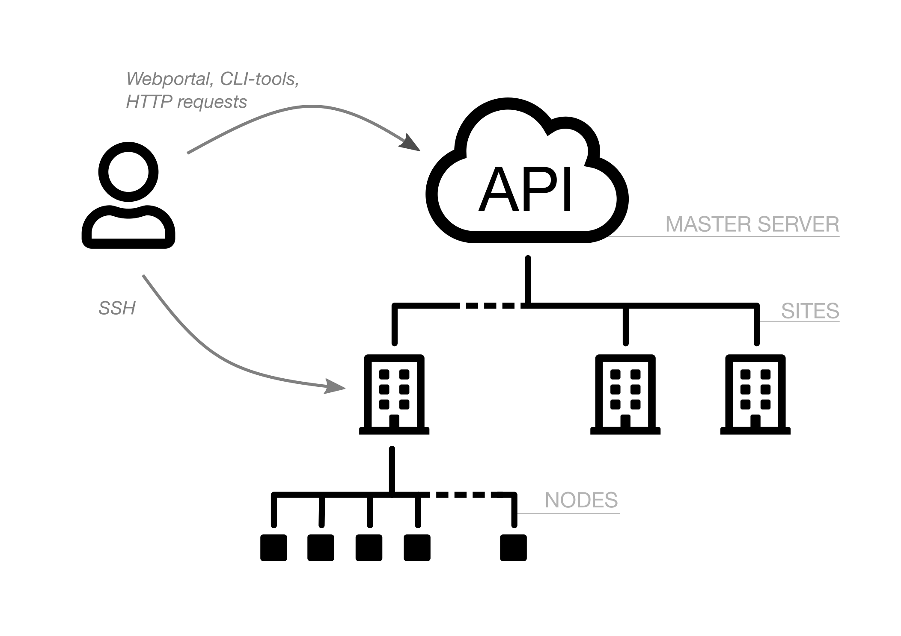
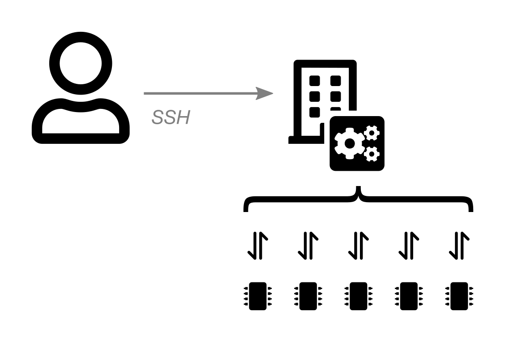
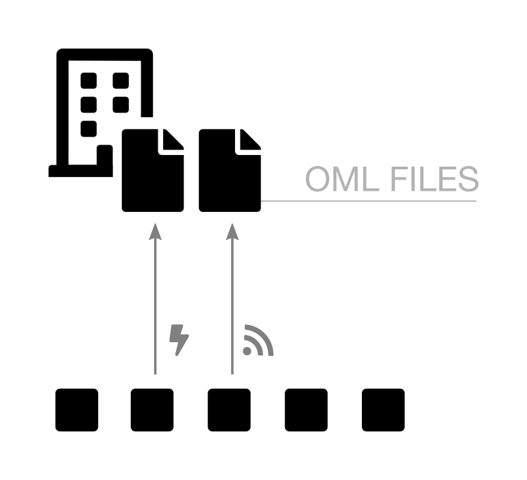
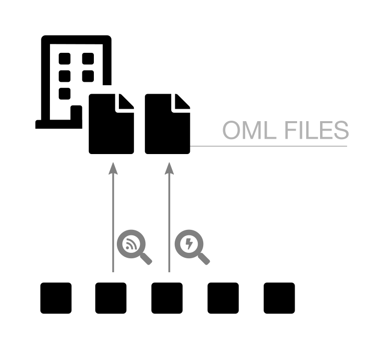
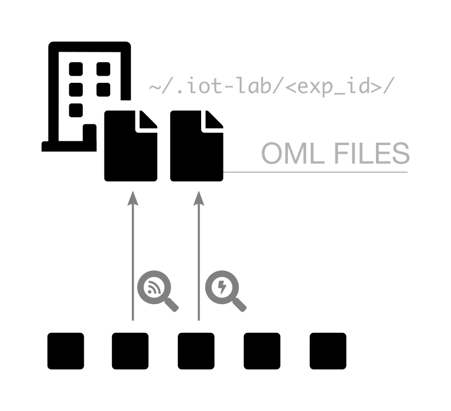
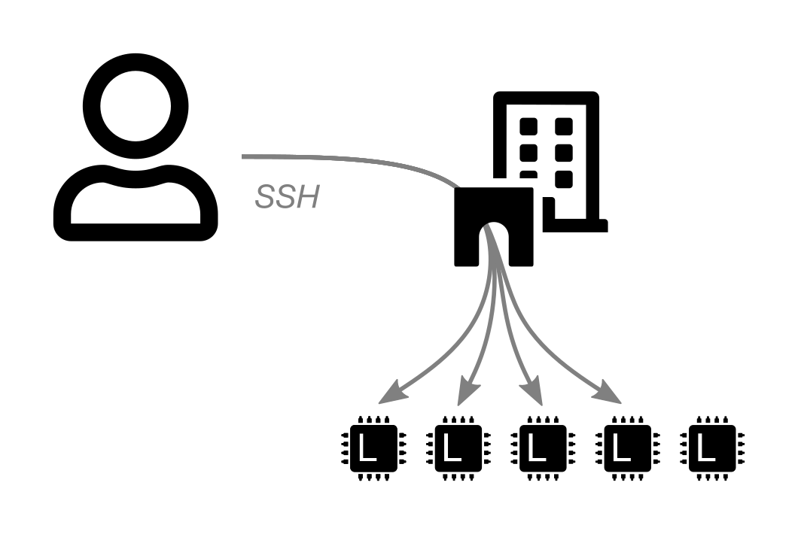

# Schemas proposal

## Infrastructure design

A - Minimal

B - Layers

C - Interact

D - Total

## Serial aggregator

## Monitoring

A - Simple icons

B - Icons in magnifying glass

C - With file path

## Debugger
TODO

## SSH-cli

## WS-cli
TODO

## IPv6
TODO
