# IoT-LAB Schemas

 
<a rel="cc:attributionURL" href="https://github.com/iot-lab/schemas">IoT-LAB schemas</a> by <a rel="cc:attributionURL" href="www.iot-lab.info">IoT-LAB</a>
is licensed under
<a rel="license" href="http://creativecommons.org/licenses/by-sa/4.0/">CC BY-SA 4.0</a>

This work has been made with [Inkscape](https://inkscape.org), based on free [Font Awesome](https://fontawesome.com) icons.

Before saving the SVG or exporting to PNG, the document size is set as follows:
- be sure that any object is selected
- open the document properties window
- in the Page tab, go to Page size > Custom size > Resize page to content ...
- set the four margins to 10
- click the Resize page to drawing or selection button

## Infrastructure design

A - Minimal
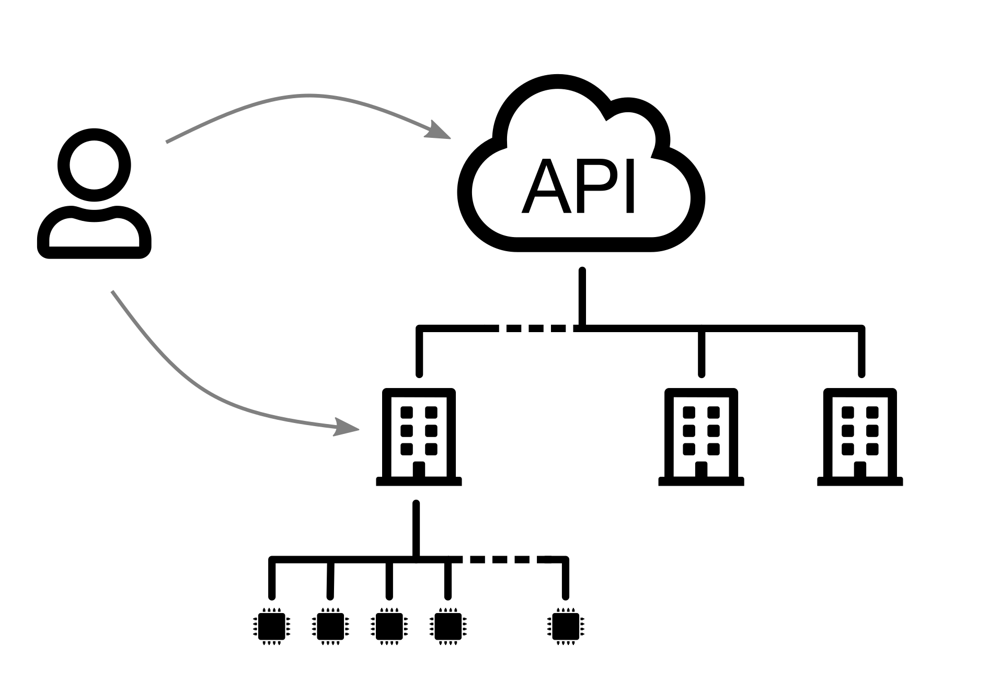

B - Layers
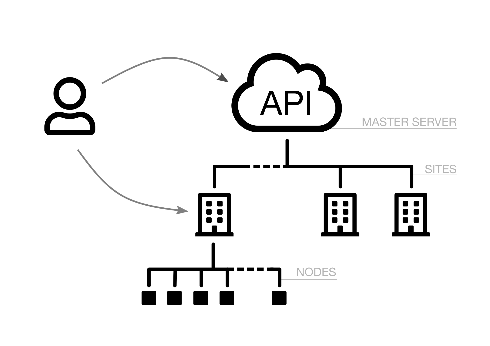

C - Interact
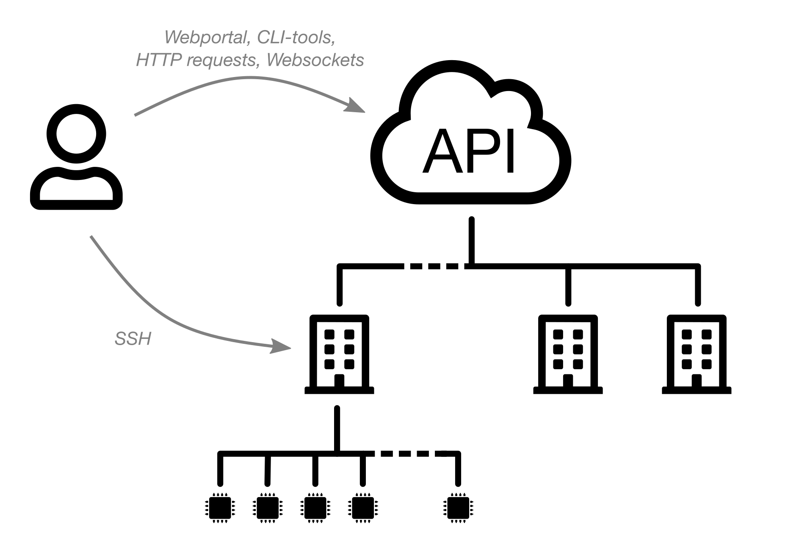

D - Total
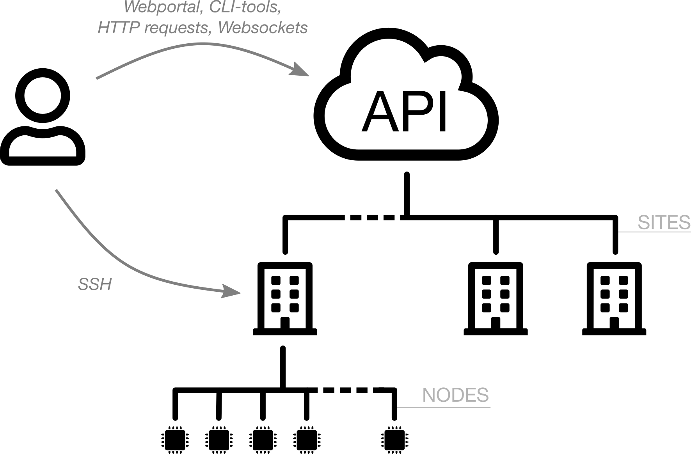

E - MOOC
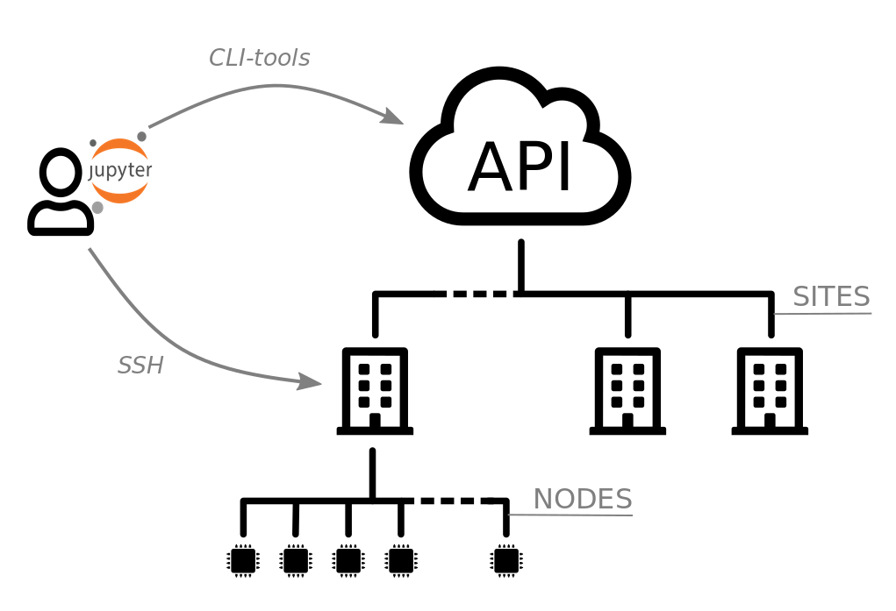

## Hardware design

1 - Microcontroller
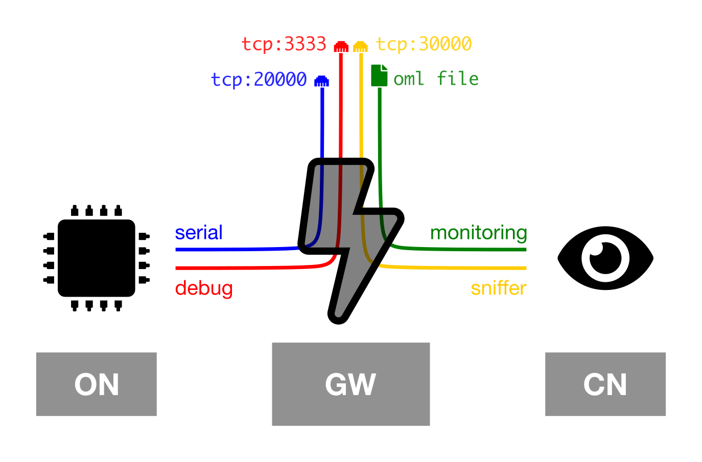

2 - Embedded Linux
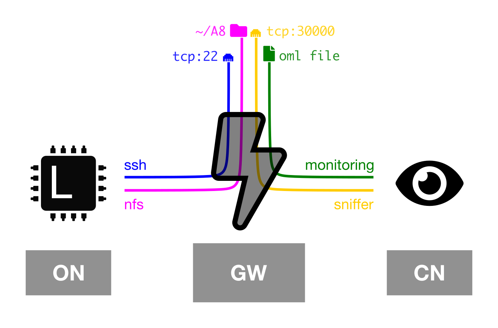

## Serial link

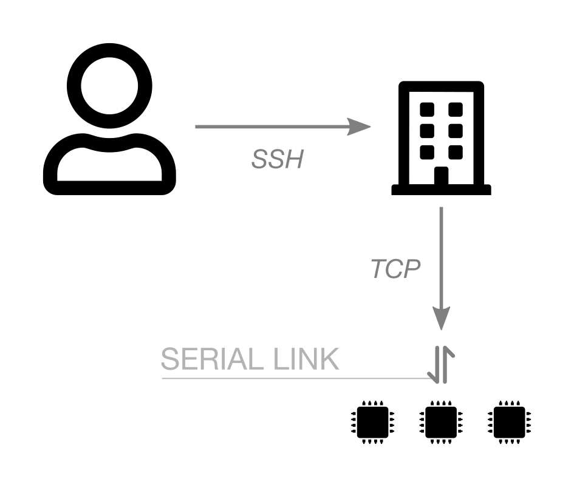

## Serial aggregator

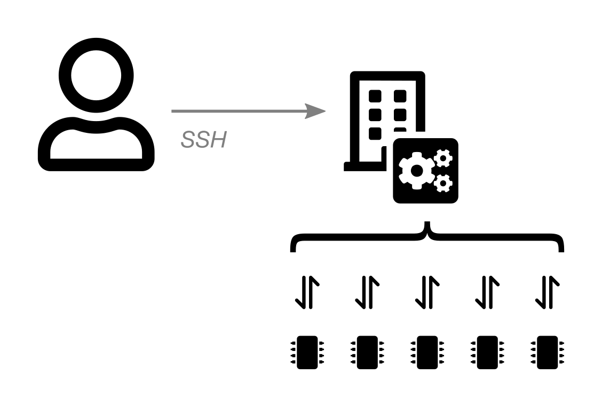

## Sniffer aggregator

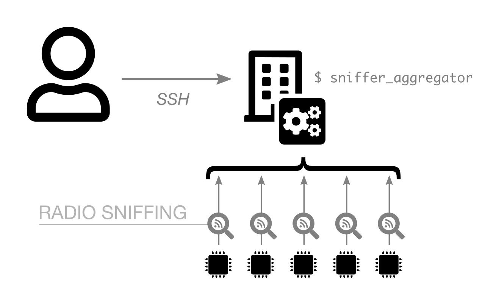

## Monitoring

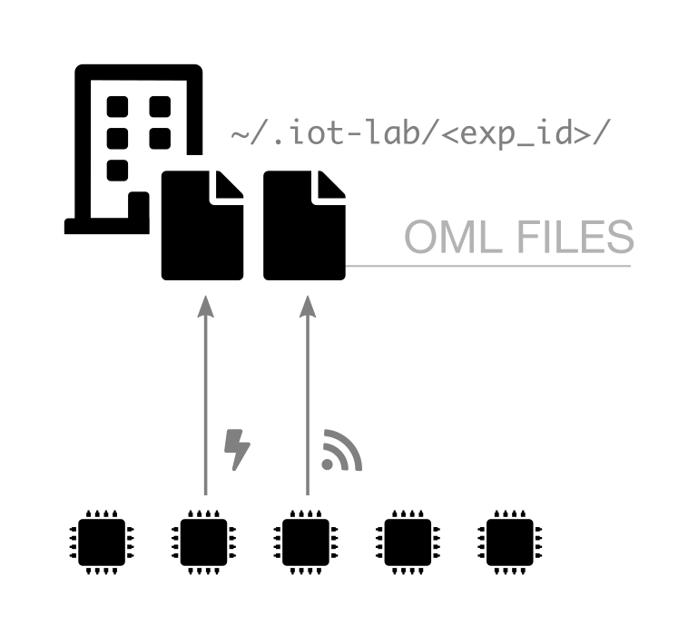

## Debug

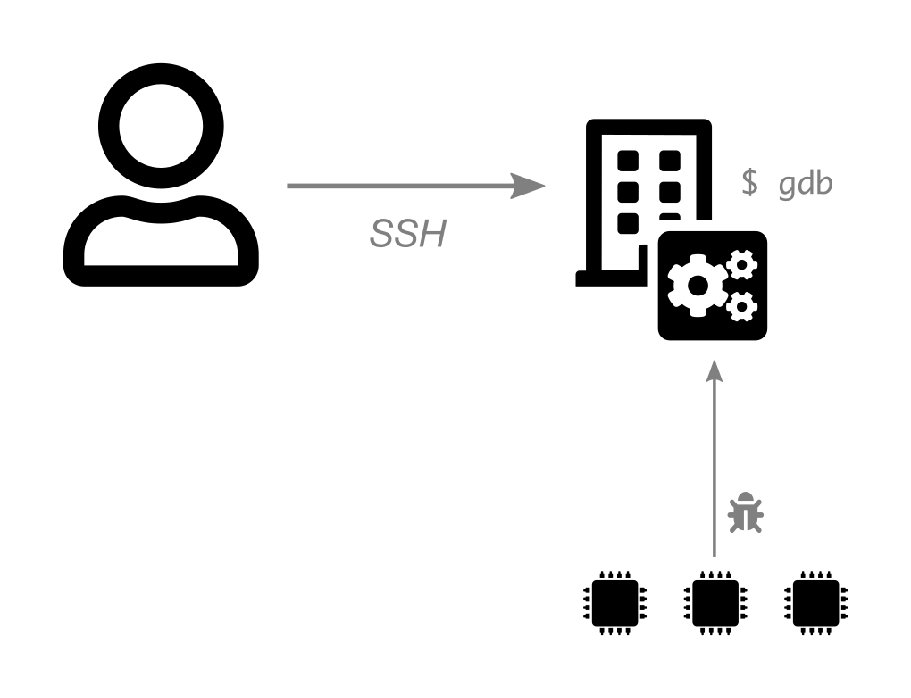

## SSH-cli

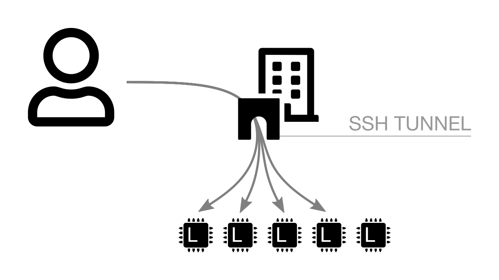

## IPv6

1 - Microcontroller
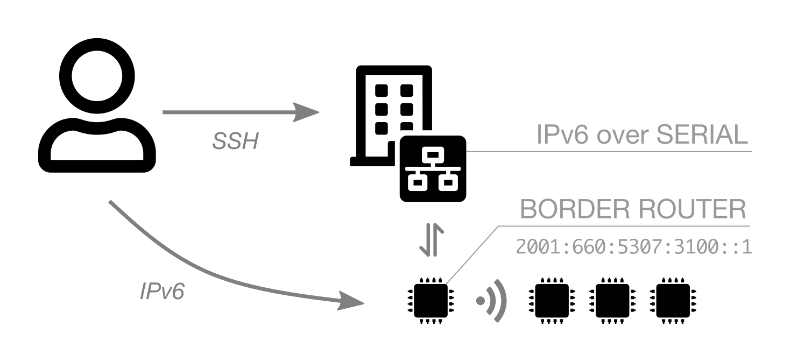

2 - Embedded Linux
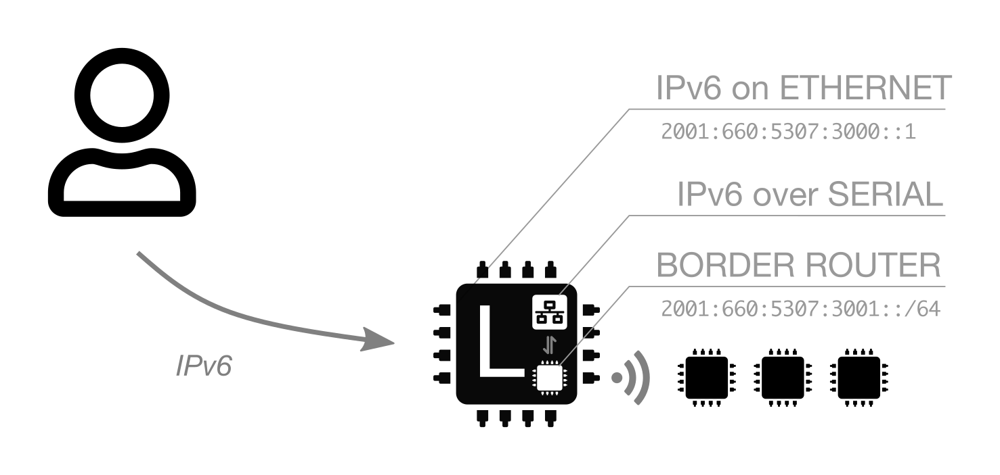
